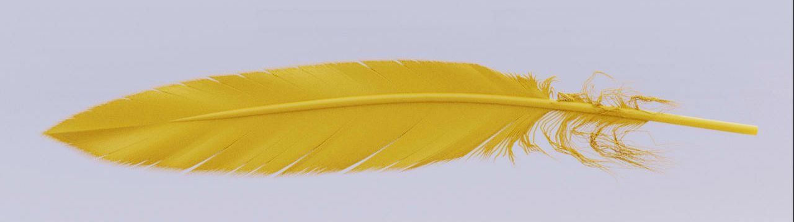
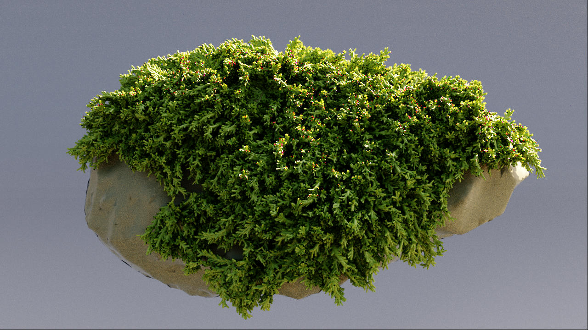
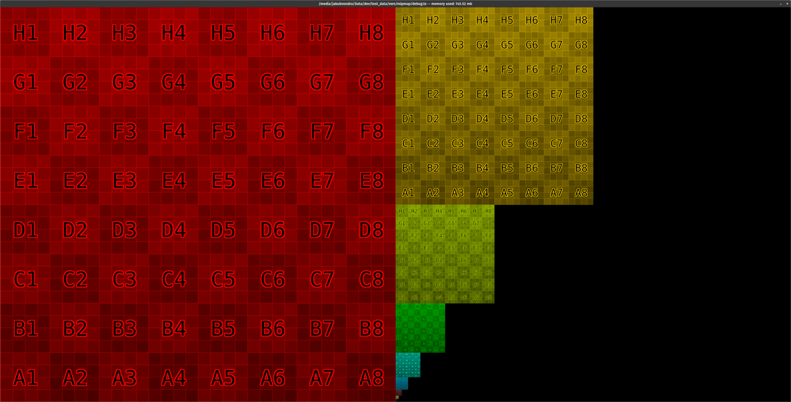

# Examples
## Geometry
### feather 
- curve geometry with width primvar

### mossy rock 
- 2 polygon meshes + 1 curve geometry with width primvar

## Textures
### Mip map debug texture 2048x2048 in .tx exr format

